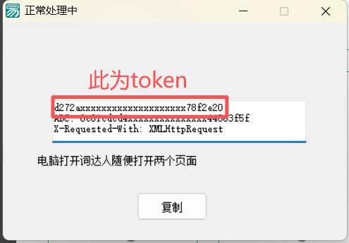

<div align="center">

    <h1>Easy_Cidaren</h1>
    <h4>Cidaren_Automatic_Answer</h4>
<p>词达人自动刷题|自动过班级任务、自学任务|<a href="https://github.com/github123666/cidaren">github123666/cidaren</a>魔改项目</p>
</div>
<div align="center">
    
    
    
</div>

## 从1.5.4版本后开始大量采用vibe coding

- 因为倒卖太多了，导致本脚本的滥用，外加官方封堵此类型脚本，本项目决定从1.5.0版本开始不再开源，但依旧免费发布
- 从1.5.4版本后，本项目开始大量采用vibe coding，并且再次开源
- 请勿宣传本软件，请勿滥用本软件，低调使用，且用且珍惜，切记，此类型脚本官方可以很轻松的封堵！！
- 本脚本仅供个人学习使用，请勿用于商业用途
- 有问题请前往[讨论区](https://github.com/ularch/Easy_Cidaren/discussions)，发现bug请提交[Issue](https://github.com/ularch/Easy_Cidaren/issues)（请使用模板格式提交，上传完整log日志，否则不予处理）

## 功能简介

`词达人自动过学习任务,测试任务`

- 自动过**学习任务**
- 自动过**测试任务**
- 暂不支持词达人官方VIP课程（可能会有问题）
- 随时可能失效,**且用且珍惜**
- 可手动选择指定任务
- 支持已完成的任务重刷
- **得分95+**（异常情况、自建任务可能80+）


## 唯一用户社区
[telegram](https://t.me/+GJXB2dFp0BQ1NjU1)

## 日志

<details> <summary> <b>展开</b> </summary>

**2026-08-12**

+ 添加答题进度显示功能，主界面实时显示已完成/总题数

**2026-07-27**

+ 重构主程序结构并优化base64解码功能

**2026-05-18**

+ 添加内置Token获取功能并完善日志系统

**2026-03-29**

+ 添加获取token子菜单功能

**2025-12-09**

+ 添加关于页面和设备ID显示功能，支持一键复制

**2025-12-08**

+ 新增任务执行状态上报与任务分数上传功能
+ 优化任务执行逻辑与UI控制

**2025-11-24**

+ 改进API错误处理和日志记录，增加文件日志记录器

**2025-11-22**

+ 修正base64解码异常处理逻辑，调整3_1024等异常jv的处理方式

**2025-11-13**

+ 修复base64解码异常处理逻辑并更新混淆索引
+ 优化更新检测逻辑

**2025-11-02**

+ 统一API错误处理并优化日志记录
+ 
**2025-10-27**

+ 修复学习任务运行报错的相关问题

**2025-10-27**

+ 发布v1.3.0版本

**2025-03-12**

+ 添加自动检测更新功能

**2024-12-23**

+ 修复“英译汉”题型报错

**2024-09-06**

+ 修复自建自学任务的已知问题

**2024-05-02**

+ 更新GUI

**2023-04-26**

+ 在原项目的基础上添加了手动选择章节功能
+ 将token等设置从config文件改为了在控制台输入

</details>

## 声明

+ 原项目[github123666/cidaren](https://github.com/github123666/cidaren)
+ 仅供学习参考，**严禁盗卖盈利！** 使用后果由使用者承担
+ 请勿在任何平台公开发布本项目

### **侵权或有疑问请联系**

+ 邮箱：cdr@ularch.top
+ Telegram：[harold_lach_lei](https://t.me/Harold_Lach_Lei)

## 快速上手

### 直接使用软件

1. 前往[release](https://github.com/ularch/Easy_Cidaren/releases/latest)下载最新版压缩包
2. 解压后双击Easy_Cidaren.exe运行程序
3. 获取 token (两种方法任选其一):

**方法一：使用内置 token 获取工具（推荐）**
- **现在使用可能会提示您的时钟快了，请自行百度抓包**
- 在弹出的图形界面中点击 `帮助`->`获取token`打开token获取软件（软件来源网络，侵权请联系）**全程不要关闭黑色cmd窗口**
- 将 `词达人token获取.exe`软件置于后台，打开电脑端微信，登录并进入微信公众号 `词达人`->`学生端`，随便点击几个页面
- 返回 `词达人token获取.exe`，复制软件中显示的内容（token）
  `<br>`词达人更新后，软件获取到的内容中第一行为词达人token，
  `新版本已修复，可直复制进脚本，若出错可手动复制尝试`
  
- 返回图形界面，将token粘贴进 `用户token`栏，点击登录
- 使用期间除获取token外，任何设备**不要登录词达人**，否则会刷新token

**方法二：命令行获取（macOS用户可选择这个）**

```bash
   cd "get token/fetch_token"
   python main.py
```

- 将链接[https://app.vocabgo.com/student/]()复制到任意微信聊天框中并发送
- 点击链接以使用微信浏览器打开
- Token 会保存在 `./get token/fetch_token/token.txt` 文件中，手动粘贴到输入框

### 本地python运行

#### 首次使用

1. 安装[python3.12](https://www.python.org/downloads/release/python-3123/)
2. 前往[release](https://github.com/ularch/Easy_Cidaren/releases/latest)下载最新版压缩包
3. 解压下载到的最新版压缩包
4. 双击运行程序文件夹中的 `点我配置环境.bat`运行`<br>`或手动运行

```
pip install -r requirements.txt
```

#### 后续使用

1. 双击运行 `点我运行.exe`弹出cmd页面
2. 运行过程中全程不要关闭cmd（黑色页面）
3. 后续与使用软件相同

## 支持项目
**[请我喝杯奶茶☕️](https://afdian.com/a/ularch)**

<div align="center">
🌟 请点点右上角的 Star，多多支持本项目开发~
</div>

[](https://starchart.cc/ularch/Easy_Cidaren)
